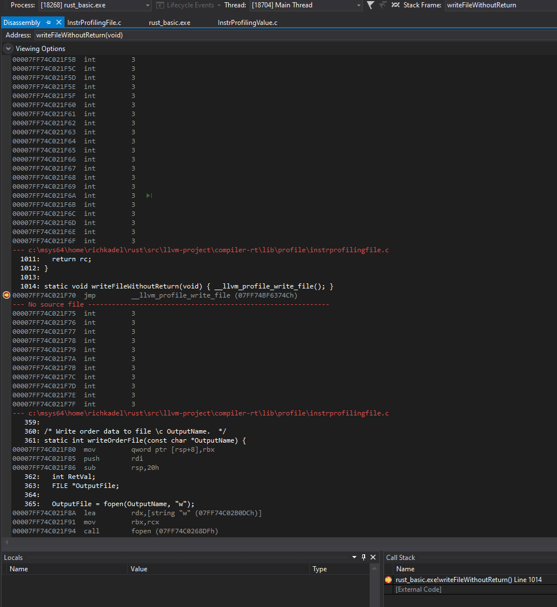

# Rust binaries compiled with -Zinstrument-coverage fail only when compiled using MSVC

## _Current status as of Aug 24, 2020_

These notes document my investigation of a bug causing Rust binaries compiled with `-Z instrument-coverage` to fail if compiled under MSVC.

The program fails during the post-exit process of writing the LLVM `*.profraw` file that captures the `llvm.instrprof.increment` intrinsic counter values from the program's execution. Typically the program crashes with a segmentation fault, or in some cases it just exits, writing an empty `*.profraw` file.

As of August 24, I did find a workaround that allows me to enable `-Z instrument-coverage` on MSVC, but it does not resolve the issue without this workaround.

I am able to successfully run coverage-instrumented programs as long as I ensure the Rust option `-C link-dead-code` is disabled.

Prior to discovering this, I was automatically enabling `-C link-dead-code` by default, when `-Z instrument-coverage` was enabled. This ensured that code that might otherwise be optimized out would still get a counter, and would show up in the final coverage reports (with `0` executions).

It appears that this error may be the result of the bug documented in the `rust-lang` issue [#64685 (_Linker error because `-wL as-needed` conflicts with `-C link-dead-code`_)](https://github.com/rust-lang/rust/issues/64685).

I've linked these notes to that bug in case the investigation results may help someone debug the original issue.

Whatever the cause, it appears that the code compiled into Rust's `profiler-builtins` library does not get linked correctly. Some key discoveries include:

* The problem described above does not manifest in coverage-enabled Clang C++ binaries, despite the fact that the process and included LLVM coverage libraries are nearly identical. I was able to compare LLVM IR output, Visual Studio debugger steps, and disassembled views of the binary in both Visual Studio and "IDA Pro", to get a sense of the similarities and differences.
* I was able to apply the same MSVC compiler flags used by Clang to build Rust's `profiler-builtins` library, and the same MSVC linker flags when linking the Rust program. None of these compiler or linker options resolved the issue. 
* The LLVM IR was largely the same for Rust and Clang (in particular, the Coverage Map's were nearly identical); but some Function Attributes were different, and I was not able to understand how or if I should normalize these.
* The Visual Studio debugger shows that some variables in the `profiler-builtins` library sources _appear to be_ "optimized out" (in fact, disassembly views seem to show that some statements were indeed not generated).
* The "IDA Pro" tool appears to show that, in the Rust executables, some function calls to LLVM' profiler runtime libraries were jumping to an address that was 4 bytes _*offset*_ from the address of the function it should have been jumping to.

That last point, and the optimized out instructions, _seem to indicate_ that the linker first assigns a bad function address (either in the function's placement, or in the call's jump statement), and then the linker (perhaps) recognizes (by cross reference?) that some functions are not called (because nothing is jumping to their actual, correct location), so the linker (perhaps) decides it can aggressively optimize out some unused variables and statements affecting those variables.

This may be the wrong conclusion, but it is my best guess.

Hopefully someone that understands this better can figure out if and how the Rust `-C link-dead-code` option seemed to trigger this behavior.

> _Update: @petrhosek has suggested a potential cause could be the `--gc-sections` linker flag, or the MSVC linker's equivalent. (In fact, Clang documentation for source code coverage also discusses some known limitations with `--gc-sections` enabled.) As it turns out, rustc translates its `-Clink-dead-code` option into a call to the `Linker`-specific wrapper function `gc_sections()`. But the `gc_sections()` function is not necessarily translated to the `--gc-sections` flag. It depends on which linker is used, and on the value of `keep_metadata`._
> 
> _Also note that there are only about 3 or 4 places that the link-dead-code option affects `rustc`. I'm not sure what would happen if we bypassed the `gc-sections()` call, without also bypassing the other code affected by the `-Clink-dead-code` flag._
> 
> https://github.com/rust-lang/rust/blob/2da73717d70ee8583d619dfa12ad8b8306eedab5/src/librustc_codegen_ssa/back/link.rs#L1667-L1675
> ```rust
>  // OBJECT-FILES-NO, AUDIT-ORDER 
>  // FIXME: Order dependent, applies to the following objects. Where should it be placed? 
>  // Try to strip as much out of the generated object by removing unused 
>  // sections if possible. See more comments in linker.rs 
>  if !sess.link_dead_code() { 
>      let keep_metadata = crate_type == CrateType::Dylib; 
>      cmd.gc_sections(keep_metadata); 
>  }
> ```
> 
> Here's the MSVC implementation of `gc_sections()`:
> 
> https://github.com/rust-lang/rust/blob/1627ba19643c18fe9a80e65c8df8bbd2f3ed8432/src/librustc_codegen_ssa/back/linker.rs#L678-L690
> ```rust
>  fn gc_sections(&mut self, _keep_metadata: bool) { 
>      // MSVC's ICF (Identical COMDAT Folding) link optimization is 
>      // slow for Rust and thus we disable it by default when not in 
>      // optimization build. 
>      if self.sess.opts.optimize != config::OptLevel::No { 
>          self.cmd.arg("/OPT:REF,ICF"); 
>      } else { 
>          // It is necessary to specify NOICF here, because /OPT:REF 
>          // implies ICF by default. 
>          self.cmd.arg("/OPT:REF,NOICF"); 
>      } 
> }

## Summary, notes, and screenshots - Aug 10-16, 2020

_Note: Most of the notes below were compiled while building with Rust's fork of LLVM 10. As of Aug 23, 2020, Rust now includes LLVM 11, and the workaround (disabling `-C link-dead-code`) was tested under LLVM 11 as well (both with and without the workaround, confirming that LLVM 11 did not, in itself at least, resolve the problem)._

*   Problem:
    *   When running a rustc-compiled “*.exe” binary compiled with -Zinstrument-coverage, the program typically crashes during program exit, with a “Segmentation fault”. Some programs don’t crash, but generate an empty “*.profraw” file.
    *   Note that Rust coverage-enabled programs work correctly on Windows compiled using GNU/gcc, and they work on Linux and MacOS.
    *   Clang-compiled C++ programs compiled under MSVC, with coverage enabled, work correctly and generate a valid “*.profraw” file, confirming that it should be possible for Rust programs to support this feature on MSVC as well.
*   Similarities between C++ and Rust coverage-enabled programs:
    *   LLVM IR coverage maps
        *   Code structure is generally the same. (Rust has some differences related to Rust runtime implementation.)
        *   Identical coverage maps
        *   Identical variable declarations, and “llvm-used” definitions (including identical, MSVC-formatted section names)
        *   Identical “__llvm_profile_*” external declaration, and profile runtime function declarations.
    *   Linker arguments
*   Notable differences between C++ and Rust coverage-enabled programs:
    *   LLVM IR, though nearly identical, showed some function attributes are different, but apparently not for the things related to coverage. It’s suspicious, but may not be significant.
    *   **_The SegFault appears to happen with Rust programs because some code, to initialize coverage counter results structures, is skipped, resulting in uninitialized memory._**
    *   I used Visual Studio to examine the “Disassembled Views” of both programs, and I also used a binary analysis tool (IDA Pro) to examine the binaries (instructions, control flows, symbols, and symbol cross-references)
        *   Many symbols in the disassembled functions (related to generating the coverage profiler output), have symbol names that mirror their original source code variable names in the C++ disassembled code, but show up as just register references, or possible mangled (internalized?) names in the Rust disassembled code. Other symbols show up with an “unk_” prefix.
        *   The control flows and instruction sets are similar between Rust and C++, but have many differences
        *   _There are several screenshots showing the results from Visual Studio and IDA in the pages below._
*   I was not able to easily deduce the Clang LLVM invocation and/or passes enabled for C++.
    *   Link-time optimization (LTO) may be a contributing factor, but I tried to disable LTO for Rust, via standard options, and it did not help. (It sounds like the MSVC linker may do some LTO by default, and I may not be able to just “turn it off”.)
*   Initial conclusions
    *   I believe the disassembled instruction sets may be different because they are probably using different compilers to compile the “compiler-rt” library (the library used to generate the “*.profraw” data).
        *   I assume Clang uses Clang to compile its “compiler-rt” library.
        *   I know Rust compiles selected sources from “compiler-rt” into the Rust “profiler-builtins” crate, using the Rust “cc” compiler wrapper, which wraps MSVC’s c++ compiler, on Windows.
    *   I believe that Rust is somehow not correctly identifying variables to be linked as “used” externs from “profiler-builtins” aka “compiler-rt”, which leads the linker to believe that some code paths are not being invoked, and optimizes them out, OR some variables are not used, and they are internalized when they shouldn’t be.
*   What I don’t know
    *   Are the function attribute differences in the LLVM IR significant? If so, how to change them.
    *   If I’m right that the linker needs to be told that some symbols need to be treated as used/external, what symbols, and how do I fix it.
    *   If it’s neither of these things, what is it, and how do I fix it?


## About Rust’s profiler-builtins library (because the missing/optimized-out symbols come from this library)

> Update (Aug 24, 2020): Clang compiles its own Clang-specific version of this library, just as Rust does, using the same LLVM sources. We inspected Clang's `ninja` build files for the compiler options used to build Clang's library, and applied the same flags to Rust's compilation of `profiler-builtins`, confirming that this change still did not resolve the main issue. Note that Clang uses the following compiler flags:

```
build projects\compiler-rt\lib\profile\CMakeFiles\clang_rt.profile-x86_64.dir\InstrProfilingBuffer.c.obj: C_COMPILER__clang_rt.2eprofile-x86_64 C$:\src\clang-llvm\llvm-project\compiler-rt\lib\profile\InstrProfilingBuffer.c || cmake_object_order_depends_target_clang_rt.profile-x86_64
  DEFINES = -DUNICODE -D_CRT_NONSTDC_NO_DEPRECATE -D_CRT_NONSTDC_NO_WARNINGS -D_CRT_SECURE_NO_DEPRECATE -D_CRT_SECURE_NO_WARNINGS -D_SCL_SECURE_NO_DEPRECATE -D_SCL_SECURE_NO_WARNINGS -D_UNICODE -D__STDC_CONSTANT_MACROS -D__STDC_FORMAT_MACROS -D__STDC_LIMIT_MACROS
  FLAGS = /DWIN32 /D_WINDOWS /Zc:inline /Zc:strictStrings /Oi -wd4141 -wd4146 -wd4244 -wd4267 -wd4291 -wd4351 -wd4456 -wd4457 -wd4458 -wd4459 -wd4503 -wd4624 -wd4722 -wd4100 -wd4127 -wd4512 -wd4505 -wd4610 -wd4510 -wd4702 -wd4245 -wd4706 -wd4310 -wd4701 -wd4703 -wd4389 -wd4611 -wd4805 -wd4204 -wd4577 -wd4091 -wd4592 -wd4319 -wd4709 -wd4324 -w14062 -we4238 /Gw /W4 /MT /O2 /Ob2    -DCOMPILER_RT_HAS_ATOMICS=1 /wd4221 -UNDEBUG
```

The sources debugged below, with missing symbols, come from `llvm-project/compiler-rt` but are compiled for Rust in this Rust-specific library of C code.

Rust compiles the profiling sources into it’s `profiler-builtins` crate (in the main `rust-lang/rust` source tree, included in `rustc` as long as “profiler = true” is set in `config.toml`).

Only specific sources from `compiler-rt` are included. These sources include the code for the InstrProf coverage counter increments, and for writing out the results of the counters at program exit (along with writing out the encoded coverage map):

[https://github.com/rust-lang/rust/blob/2c31b45ae878b821975c4ebd94cc1e49f6073fd0/library/profiler_builtins/build.rs#L15-L35](https://github.com/rust-lang/rust/blob/2c31b45ae878b821975c4ebd94cc1e49f6073fd0/library/profiler_builtins/build.rs#L15-L35)

The library is compiled via [Cargo.toml build-dependency](https://github.com/rust-lang/rust/blob/2c31b45ae878b821975c4ebd94cc1e49f6073fd0/library/profiler_builtins/Cargo.toml#L16-L17):

*   [https://crates.io/crates/cc/1.0.1](https://crates.io/crates/cc/1.0.1) (github: [https://github.com/alexcrichton/cc-rs](https://github.com/alexcrichton/cc-rs))
*   Note this is a very old version of the crate, from October 11, 2017; the current version (as of Aug 10) is [https://crates.io/crates/cc](https://crates.io/crates/cc) published in July 2020.
*   It uses an external C compiler. In the case of Windows, _“Windows platforms targeting MSVC (e.g. your target triple ends in -msvc) require cl.exe to be available and in PATH. This is typically found in standard Visual Studio installations and the PATH can be set up by running the appropriate developer tools shell.”_

Some questions at this point:

1. Do I need to explicitly export some symbols?
2. Is there a small set of symbols to export, that will preserve other symbol dependencies that seem to have been either “optimized away” or internalized, so they appear optimized away?
3. If so, which symbols do I need to explicitly export?
4. How do I explicitly export them?

More observations:

*   linker.rs has a Linker trait function (for different linkers including Gcc and Msvc) called `fn export_symbols(&mut self, tmpdir: &Path, crate_type: CrateType)`
*   Which Linker trait impl would be used to export these symbols? Does it link the profiler-builtins library? Or is the problem relevant to linking my test executable only?
*   Note the different logic in each Linker trait impl

I’m assuming the MsvcLinker is the one that’s used for both library and executable. Note the potentially relevant comment:

```rust
    // Currently the compiler doesn't use `dllexport` (an LLVM attribute) to
    // export symbols from a dynamic library. When building a dynamic library,
    // however, we're going to want some symbols exported, so this function
    // generates a DEF file which lists all the symbols.
    //
    // The linker will read this `*.def` file and export all the symbols from
    // the dynamic library. Note that this is not as simple as just exporting
    // all the symbols in the current crate (as specified by `codegen.reachable`)
    // but rather we also need to possibly export the symbols of upstream
    // crates. Upstream rlibs may be linked statically to this dynamic library,
    // in which case they may continue to transitively be used and hence need
    // their symbols exported.
    fn export_symbols(&mut self, tmpdir: &Path, crate_type: CrateType) {
        // Symbol visibility takes care of this typically
        if crate_type == CrateType::Executable {
            return;
        }
        let path = tmpdir.join("lib.def");
            writeln!(f, "LIBRARY")?;
            writeln!(f, "EXPORTS")?;
            for symbol in self.info.exports[&crate_type].iter() {
                debug!("  _{}", symbol);
                writeln!(f, "  {}", symbol)?;
```
...

Note, exports probably come from:

```rust
fn exported_symbols(tcx: TyCtxt&lt;'_>, crate_type: CrateType) -> Vec&lt;String> {
    if let Some(ref exports) = tcx.sess.target.target.options.override_export_symbols {
        return exports.clone();
    }
```
...
```rust
// ... else
    for &(symbol, level) in tcx.exported_symbols(LOCAL_CRATE).iter() {
```
...
```rust
fn exported_symbols_provider_local(

    tcx: TyCtxt&lt;'tcx>,

    cnum: CrateNum,

) -> &'tcx [(ExportedSymbol&lt;'tcx>, SymbolExportLevel)] {
```

## LLVM documentation on Source-Based Code Coverage describes some of the related externalized variables and functions

But since I know the program is attempting to generate the “*.profraw” output, it appears that the static initializer is working. No?

Note the related (if relevant) documentation on [Clang Source Based Code Coverage](https://github.com/rust-lang/llvm-project/blob/859bf4d2bea2404bd2eac92451f2db4371ec6eb4/clang/docs/SourceBasedCodeCoverage.rst#L244-L270):

> ### Using the profiling runtime without static initializers
> By default the compiler runtime uses a static initializer to determine the
> profile output path and to register a writer function. To collect profiles
> without using static initializers, do this manually:
> * Export a `int __llvm_profile_runtime` symbol from each instrumented shared
>   library and executable. When the linker finds a definition of this symbol, it
>   knows to skip loading the object which contains the profiling runtime's
>   static initializer.
> * Forward-declare `void __llvm_profile_initialize_file(void)` and call it
>   once from each instrumented executable. This function parses
>   `LLVM_PROFILE_FILE`, sets the output path, and truncates any existing files
>   at that path. To get the same behavior without truncating existing files,
>   pass a filename pattern string to `void __llvm_profile_set_filename(char
>   *)`.  These calls can be placed anywhere so long as they precede all calls
>   to `__llvm_profile_write_file`.
> * Forward-declare `int __llvm_profile_write_file(void)` and call it to write
>   out a profile. This function returns 0 when it succeeds, and a non-zero value
>   otherwise. Calling this function multiple times appends profile data to an
>   existing on-disk raw profile.
> In C++ files, declare these as `extern "C"`.

## Test programs used


### cc_basic.cc


```
void testfunc() {
}

int main() {
 for (int i = 0; i < 10; i++) {
   testfunc();
 }
 return 0;
}
```

### rust_basic.cc (written this way to produce LLVM IR control flow instructions very close to the C++ version)

```
fn testfunc() {
}

fn main() {
   let mut i = 0;
   loop {
       if i >= 10 {
           break;
       }
       testfunc();
       i += 1;
   }
}
```

## LLVM IR comparison

Apologies for the two massive screenshots, but this colorized diff view helps me see/show the differences at the line and character level.

(I can provide the output files, original and normalized, if requested.)

Note that I manually massaged the LLVM IR to break up long lines into more comparable components, changed some identifiers to help them match more closely (without changing the semantics within each file), reorder sections to match them up between files, and changed some of the larger numbers (e.g., hash values) to make them match, if they are not relevant to the structural semantics.

Notably the same:

*   declare void @llvm.instrprof.increment(i8*, i64, i32, i32) #1
    *   The #1 refers to a function attribute list. The number was not the same, but the list was the same: “nounwind”
*   The function definition for @__llvm_profile_runtime_user(), including the reference to @__llvm_profile_runtime (with “noinline” for Function Attrs)

I can identify only a couple of differences that MIGHT change the way these programs operate.

*   Function Attrs (in particular, attributes #0, applied to testfunc(), and #2 applied to main())
*   Module metadata (I think it’s called) variables near the end, that start with “!”

C++ is on the left, and Rust is on the right:


## Debugging differences in 1) first available breakpoint line in __llvm_profile_write_file, 2) Locals shown by Rust as “optimized away”, and 3) available call stack


## Differences in VS2017 disassembly views


## I was able to set a separate breakpoint in a caller of __llvm_profile_write_file();

And as soon as I “Stepped Into” the function, the debugger stack only showed __llvm_profile_write_file() (again) and did not show the function I JUST STEPPED FROM!



## Similarly, I can’t see the caller of __llvm_profile_register_write_file_atexit()


## Did NOT Break in InstrProfilingRuntime.cpp caller of __llvm_profile_register_write_file_atexit() (RegisterRuntime class constructor, sometimes invoked by static initialization

And I cannot see any other place in the rust or llvm-project codebase where this would be called??


## While looking, I saw this interesting list inside a test function:

Some of these references remind me of a build.rs section in rust profiler-builtins library. Do I need to add these __llvm_profile… symbol? Or do I need to add them to a symbol_export.rs section?

[https://github.com/rust-lang/llvm-project/blob/17e2521724d49ea3fea6ff774499de1e942db782/compiler-rt/test/profile/instrprof-without-libc.c](https://github.com/rust-lang/llvm-project/blob/17e2521724d49ea3fea6ff774499de1e942db782/compiler-rt/test/profile/instrprof-without-libc.c)

```c
// CHECK-SYMBOLS-NOT: {{ }}___cxx_global_var_init
// CHECK-SYMBOLS-NOT: {{ }}___llvm_profile_register_write_file_atexit
// CHECK-SYMBOLS-NOT: {{ }}___llvm_profile_set_filename
// CHECK-SYMBOLS-NOT: {{ }}___llvm_profile_write_file
// CHECK-SYMBOLS-NOT: {{ }}_fdopen
// CHECK-SYMBOLS-NOT: {{ }}_fopen
// CHECK-SYMBOLS-NOT: {{ }}_fwrite
// CHECK-SYMBOLS-NOT: {{ }}_getenv
// CHECK-SYMBOLS-NOT: {{ }}getenv
// CHECK-SYMBOLS-NOT: {{ }}_malloc
// CHECK-SYMBOLS-NOT: {{ }}malloc
// CHECK-SYMBOLS-NOT: {{ }}_calloc
// CHECK-SYMBOLS-NOT: {{ }}calloc
// CHECK-SYMBOLS-NOT: {{ }}_free
// CHECK-SYMBOLS-NOT: {{ }}free
// CHECK-SYMBOLS-NOT: {{ }}_open
```

Note profiler-builtins library has this build section:

```rust
    if target.contains("msvc") {
        // Don't pull in extra libraries on MSVC
        cfg.flag("/Zl");
        profile_sources.push("WindowsMMap.c");
        cfg.define("strdup", Some("_strdup"));
        cfg.define("open", Some("_open"));
        cfg.define("fdopen", Some("_fdopen"));
        cfg.define("getpid", Some("_getpid"));
        cfg.define("fileno", Some("_fileno"));
    } else {
        // Turn off various features of gcc and such, mostly copying
        // compiler-rt's build system already
        cfg.flag("-fno-builtin");
        cfg.flag("-fvisibility=hidden");
        cfg.flag("-fomit-frame-pointer");
        cfg.define("VISIBILITY_HIDDEN", None);
        if !target.contains("windows") {
            cfg.define("COMPILER_RT_HAS_UNAME", Some("1"));
        } else {
            profile_sources.push("WindowsMMap.c");
        }
    }
```

## Differences in disassembly at bottom of debuggable stack in rust_basic.exe


## Clang profile option (looking at the code):

```cpp
  if (ProfileGenerateArg) {
    if (ProfileGenerateArg->getOption().matches(
            options::OPT_fprofile_instr_generate_EQ))
      CmdArgs.push_back(Args.MakeArgString(Twine("-fprofile-instrument-path=") +
                                           ProfileGenerateArg->getValue()));
    // The default is to use Clang Instrumentation.
    CmdArgs.push_back("-fprofile-instrument=clang");
    if (TC.getTriple().isWindowsMSVCEnvironment()) {
      // Add dependent lib for clang_rt.profile
      CmdArgs.push_back(Args.MakeArgString("--dependent-lib=" +
                                           TC.getCompilerRT(Args, "profile")));
    }
  }
```

## Target-specific values for #define’s used in compiler-rt

```cpp
#include "compiler-rt/lib/profile/InstrProfilingPort.h"
```

```
COMPILER_RT_SEG           = "" 
COMPILER_RT_ALIGNAS       is not defined 
COMPILER_RT_VISIBILITY    = 
COMPILER_RT_WEAK          = __declspec(selectany) 
COMPILER_RT_ALLOCA        = _alloca 
COMPILER_RT_FTRUNCATE     is not defined
COMPILER_RT_ALWAYS_INLINE = __forceinline 
COMPILER_RT_CLEANUP       is not defined 
COMPILER_RT_ALIGNAS       is not defined
COMPILER_RT_VISIBILITY    = 
COMPILER_RT_WEAK          = __declspec(selectany) 
COMPILER_RT_ALLOCA        = _alloca 
COMPILER_RT_FTRUNCATE     is not defined
COMPILER_RT_ALWAYS_INLINE = __forceinline 
COMPILER_RT_CLEANUP       is not defined 
__APPLE__                 is not defined 
COMPILER_RT_SECTION(Sect  = __declspec(allocate(Sect))
_MSC_VER                  = 1916 
_WIN32                    = 1 
_WIN64                    = 1 
__FreeBSD__               is not defined 
```

## Initializer called from Rust runtime


## The static initializer. Clang (on left) vs Rust (on right)

[https://github.com/rust-lang/llvm-project/blob/f208b70fbc4dee78067b3c5bd6cb92aa3ba58a1e/clang/docs/SourceBasedCodeCoverage.rst#using-the-profiling-runtime-without-static-initializers](https://github.com/rust-lang/llvm-project/blob/f208b70fbc4dee78067b3c5bd6cb92aa3ba58a1e/clang/docs/SourceBasedCodeCoverage.rst#using-the-profiling-runtime-without-static-initializers)


## clang++ -mllvm "--version" -mllvm "-help"

```
LLVM (http://llvm.org/):
  LLVM version 10.0.1-rust-dev
  Optimized build with assertions.
  Default target: x86_64-pc-windows-msvc
  Host CPU: skylake-avx512

>"build\x86_64-pc-windows-msvc\llvm\bin\clang++.exe" cc_basic.cc -fprofile-instr-generate -fcoverage-mapping -o cc_basic.exe -g -mllvm "-help"
USAGE: clang (LLVM option parsing) [options]

OPTIONS:

Color Options:

  --color                                             - Use colors in output (default=autodetect)

General options:

  --aarch64-neon-syntax=<value>                       - Choose style of NEON code to emit from AArch64 backend:
    =generic                                          -   Emit generic NEON assembly
    =apple                                            -   Emit Apple-style NEON assembly
  --arm-add-build-attributes                          -
  --arm-implicit-it=<value>                           - Allow conditional instructions outdside of an IT block
    =always                                           -   Accept in both ISAs, emit implicit ITs in Thumb
    =never                                            -   Warn in ARM, reject in Thumb
    =arm                                              -   Accept in ARM, reject in Thumb
    =thumb                                            -   Warn in ARM, emit implicit ITs in Thumb
  --atomic-counter-update-promoted                    - Do counter update using atomic fetch add  for promoted counters only
  --bounds-checking-single-trap                       - Use one trap block per function
  --cost-kind=<value>                                 - Target cost kind
    =throughput                                       -   Reciprocal throughput
    =latency                                          -   Instruction latency
    =code-size                                        -   Code size
  --cvp-dont-add-nowrap-flags                         -
  --do-counter-promotion                              - Do counter register promotion
  --emscripten-cxx-exceptions-whitelist=<string>      - The list of function names in which Emscripten-style exception handling is enabled (see emscripten EMSCRIPTEN_CATCHING_WHITELIST options)
  --enable-cse-in-irtranslator                        - Should enable CSE in irtranslator
  --enable-cse-in-legalizer                           - Should enable CSE in Legalizer
  --enable-emscripten-cxx-exceptions                  - WebAssembly Emscripten-style exception handling
  --enable-emscripten-sjlj                            - WebAssembly Emscripten-style setjmp/longjmp handling
  --enable-gvn-memdep                                 -
  --enable-load-pre                                   -
  --enable-loop-simplifycfg-term-folding              -
  --enable-name-compression                           - Enable name string compression
  --expensive-combines                                - Enable expensive instruction combines
  --gpsize=<uint>                                     - Global Pointer Addressing Size.  The default size is 8.
  --hash-based-counter-split                          - Rename counter variable of a comdat function based on cfg hash
  --import-all-index                                  - Import all external functions in index.
  --instcombine-code-sinking                          - Enable code sinking
  --instcombine-guard-widening-window=<uint>          - How wide an instruction window to bypass looking for another guard
  --instcombine-max-iterations=<uint>                 - Limit the maximum number of instruction combining iterations
  --instcombine-max-num-phis=<uint>                   - Maximum number phis to handle in intptr/ptrint folding
  --instcombine-maxarray-size=<uint>                  - Maximum array size considered when doing a combine
  --instrprof-atomic-counter-update-all               - Make all profile counter updates atomic (for testing only)
  --internalize-public-api-file=<filename>            - A file containing list of symbol names to preserve
  --internalize-public-api-list=<list>                - A list of symbol names to preserve
  --iterative-counter-promotion                       - Allow counter promotion across the whole loop nest.
  --lto-embed-bitcode                                 - Embed LLVM bitcode in object files produced by LTO
  --matrix-propagate-shape                            -
  --max-counter-promotions=<int>                      - Max number of allowed counter promotions
  --max-counter-promotions-per-loop=<uint>            - Max number counter promotions per loop to avoid increasing register pressure too much
  --memop-size-large=<uint>                           - Set large value thresthold in memory intrinsic size profiling. Value of 0 disables the large value profiling.
  --memop-size-range=<string>                         - Set the range of size in memory intrinsic calls to be profiled precisely, in a format of <start_val>:<end_val>
  --merror-missing-parenthesis                        - Error for missing parenthesis around predicate registers
  --merror-noncontigious-register                     - Error for register names that aren't contigious
  --mhvx                                              - Enable Hexagon Vector eXtensions
  --mhvx=<value>                                      - Enable Hexagon Vector eXtensions
    =v60                                              -   Build for HVX v60
    =v62                                              -   Build for HVX v62
    =v65                                              -   Build for HVX v65
    =v66                                              -   Build for HVX v66
  --mips-compact-branches=<value>                     - MIPS Specific: Compact branch policy.
    =never                                            -   Do not use compact branches if possible.
    =optimal                                          -   Use compact branches where appropiate (default).
    =always                                           -   Always use compact branches if possible.
  --mips16-constant-islands                           - Enable mips16 constant islands.
  --mips16-hard-float                                 - Enable mips16 hard float.
  --mno-compound                                      - Disable looking for compound instructions for Hexagon
  --mno-fixup                                         - Disable fixing up resolved relocations for Hexagon
  --mno-ldc1-sdc1                                     - Expand double precision loads and stores to their single precision counterparts
  --mno-pairing                                       - Disable looking for duplex instructions for Hexagon
  --mwarn-missing-parenthesis                         - Warn for missing parenthesis around predicate registers
  --mwarn-noncontigious-register                      - Warn for register names that arent contigious
  --mwarn-sign-mismatch                               - Warn for mismatching a signed and unsigned value
  --no-discriminators                                 - Disable generation of discriminator information.
  --nvptx-sched4reg                                   - NVPTX Specific: schedule for register pressue
  --poison-checking-function-local                    - Check that returns are non-poison (for testing)
  --rdf-dump                                          -
  --rdf-limit=<uint>                                  -
  --safepoint-ir-verifier-print-only                  -
  --sample-profile-check-record-coverage=<N>          - Emit a warning if less than N% of records in the input profile are matched to the IR.
  --sample-profile-check-sample-coverage=<N>          - Emit a warning if less than N% of samples in the input profile are matched to the IR.
  --sample-profile-max-propagate-iterations=<uint>    - Maximum number of iterations to go through when propagating sample block/edge weights through the CFG.
  --speculative-counter-promotion-max-exiting=<uint>  - The max number of exiting blocks of a loop to allow  speculative counter promotion
  --speculative-counter-promotion-to-loop             - When the option is false, if the target block is in a loop, the promotion will be disallowed unless the promoted counter  update can be further/iteratively promoted into an acyclic  region.
  --summary-file=<string>                             - The summary file to use for function importing.
  --verify-region-info                                - Verify region info (time consuming)
  --vp-counters-per-site=<number>                     - The average number of profile counters allocated per value profiling site.
  --vp-static-alloc                                   - Do static counter allocation for value profiler
  --x86-align-branch=<(plus separated list of types)> - Specify types of branches to align. The branches's types are combination of jcc, fused, jmp, call, ret, indirect. jcc indicates conditional jumps, fused indicates fused conditional jumps, jmp indicates unconditional jumps, call indicates direct and indirect calls, ret indicates rets, indirect indicates indirect jumps.
  --x86-align-branch-boundary=<uint>                  - Control how the assembler should align branches with NOP. If the boundary's size is not 0, it should be a power of 2 and no less than 32. Branches will be aligned to prevent from being across or against the boundary of specified size. The default value 0 does not align branches.
  --x86-branches-within-32B-boundaries                - Align selected instructions to mitigate negative performance impact of Intel's micro code update for errata skx102.  May break assumptions about labels corresponding to particular instructions, and should be used with caution.

Generic Options:

  --help                                              - Display available options (--help-hidden for more)
  --help-list                                         - Display list of available options (--help-list-hidden for more)
  --version                                           - Display the version of this program
C:\Users\RICHKA~1\AppData\Local\Temp\cc_basic-35f4b6.o : fatal error LNK1136: invalid or corrupt file
clang++: error: linker command failed with exit code 1136 (use -v to see invocation)
```

## rustc --llvm-args="--version" and --llvm-args="-help"

```
LLVM (http://llvm.org/):
  LLVM version 10.0.1-rust-dev
  Optimized build with assertions.
  Default target: x86_64-pc-windows-msvc
  Host CPU: skylake-avx512
```

YES SAME VERSION AS Clang

candidates:

```
  --internalize-public-api-list=&lt;list>                - A list of symbol names to preserve
  -rdf-dump -rdf-limit=&lt;uint>     
  -lto-pass-remarks-output=&lt;filename>               - Output filename for pass remarks
```

```
Note it looks like llvm is set up with a "command name" setting set to "rustc", which is why the error messages are so confusing and unhelpful:

rustc: Unknown command line argument '-disable-opt'.  Try: 'rustc --help'
rustc: Did you mean '--disable-vp'?

Note the "USAGE" line below:

-Cllvm-args="-help" --emit llvm-ir,link
warning: Rust source-based code coverage instrumentation (with `-Z instrument-coverage`) is not yet supported on Windows when targeting MSVC. The resulting binaries will still be instrumented for experimentation purposes, but may not execute correctly.

USAGE: rustc --llvm-args="" with [options]

OPTIONS:

Color Options:

  --color                                             - Use colors in output (default=autodetect)

General options:

  --aarch64-neon-syntax=<value>                       - Choose style of NEON code to emit from AArch64 backend:
    =generic                                          -   Emit generic NEON assembly
    =apple                                            -   Emit Apple-style NEON assembly
  --arm-add-build-attributes                          -
  --arm-implicit-it=<value>                           - Allow conditional instructions outdside of an IT block
    =always                                           -   Accept in both ISAs, emit implicit ITs in Thumb
    =never                                            -   Warn in ARM, reject in Thumb
    =arm                                              -   Accept in ARM, reject in Thumb
    =thumb                                            -   Warn in ARM, emit implicit ITs in Thumb
  --atomic-counter-update-promoted                    - Do counter update using atomic fetch add  for promoted counters only
  --bounds-checking-single-trap                       - Use one trap block per function
  --cost-kind=<value>                                 - Target cost kind
    =throughput                                       -   Reciprocal throughput
    =latency                                          -   Instruction latency
    =code-size                                        -   Code size
  --cvp-dont-add-nowrap-flags                         -
  --debugify-quiet                                    - Suppress verbose debugify output
  --do-counter-promotion                              - Do counter register promotion
  --emscripten-cxx-exceptions-whitelist=<string>      - The list of function names in which Emscripten-style exception handling is enabled (see emscripten EMSCRIPTEN_CATCHING_WHITELIST options)
  --enable-cse-in-irtranslator                        - Should enable CSE in irtranslator
  --enable-cse-in-legalizer                           - Should enable CSE in Legalizer
  --enable-emscripten-cxx-exceptions                  - WebAssembly Emscripten-style exception handling
  --enable-emscripten-sjlj                            - WebAssembly Emscripten-style setjmp/longjmp handling
  --enable-gvn-memdep                                 -
  --enable-load-pre                                   -
  --enable-loop-simplifycfg-term-folding              -
  --enable-name-compression                           - Enable name string compression
  --expensive-combines                                - Enable expensive instruction combines
  --gpsize=<uint>                                     - Global Pointer Addressing Size.  The default size is 8.
  --hash-based-counter-split                          - Rename counter variable of a comdat function based on cfg hash
  --import-all-index                                  - Import all external functions in index.
  --instcombine-code-sinking                          - Enable code sinking
  --instcombine-guard-widening-window=<uint>          - How wide an instruction window to bypass looking for another guard
  --instcombine-max-iterations=<uint>                 - Limit the maximum number of instruction combining iterations
  --instcombine-max-num-phis=<uint>                   - Maximum number phis to handle in intptr/ptrint folding
  --instcombine-maxarray-size=<uint>                  - Maximum array size considered when doing a combine
  --instrprof-atomic-counter-update-all               - Make all profile counter updates atomic (for testing only)
  --internalize-public-api-file=<filename>            - A file containing list of symbol names to preserve
  --internalize-public-api-list=<list>                - A list of symbol names to preserve
  --iterative-counter-promotion                       - Allow counter promotion across the whole loop nest.
  --lto-embed-bitcode                                 - Embed LLVM bitcode in object files produced by LTO
  --lto-pass-remarks-filter=<regex>                   - Only record optimization remarks from passes whose names match the given regular expression
  --lto-pass-remarks-format=<format>                  - The format used for serializing remarks (default: YAML)
  --lto-pass-remarks-output=<filename>                - Output filename for pass remarks
  --matrix-propagate-shape                            -
  --max-counter-promotions=<int>                      - Max number of allowed counter promotions
  --max-counter-promotions-per-loop=<uint>            - Max number counter promotions per loop to avoid increasing register pressure too much
  --memop-size-large=<uint>                           - Set large value thresthold in memory intrinsic size profiling. Value of 0 disables the large value profiling.
  --memop-size-range=<string>                         - Set the range of size in memory intrinsic calls to be profiled precisely, in a format of <start_val>:<end_val>
  --merror-missing-parenthesis                        - Error for missing parenthesis around predicate registers
  --merror-noncontigious-register                     - Error for register names that aren't contigious
  --mhvx                                              - Enable Hexagon Vector eXtensions
  --mhvx=<value>                                      - Enable Hexagon Vector eXtensions
    =v60                                              -   Build for HVX v60
    =v62                                              -   Build for HVX v62
    =v65                                              -   Build for HVX v65
    =v66                                              -   Build for HVX v66
  --mips-compact-branches=<value>                     - MIPS Specific: Compact branch policy.
    =never                                            -   Do not use compact branches if possible.
    =optimal                                          -   Use compact branches where appropiate (default).
    =always                                           -   Always use compact branches if possible.
  --mips16-constant-islands                           - Enable mips16 constant islands.
  --mips16-hard-float                                 - Enable mips16 hard float.
  --mno-compound                                      - Disable looking for compound instructions for Hexagon
  --mno-fixup                                         - Disable fixing up resolved relocations for Hexagon
  --mno-ldc1-sdc1                                     - Expand double precision loads and stores to their single precision counterparts
  --mno-pairing                                       - Disable looking for duplex instructions for Hexagon
  --mwarn-missing-parenthesis                         - Warn for missing parenthesis around predicate registers
  --mwarn-noncontigious-register                      - Warn for register names that arent contigious
  --mwarn-sign-mismatch                               - Warn for mismatching a signed and unsigned value
  --no-discriminators                                 - Disable generation of discriminator information.
  --nvptx-sched4reg                                   - NVPTX Specific: schedule for register pressue
  --poison-checking-function-local                    - Check that returns are non-poison (for testing)
  --rdf-dump                                          -
  --rdf-limit=<uint>                                  -
  --safepoint-ir-verifier-print-only                  -
  --sample-profile-check-record-coverage=<N>          - Emit a warning if less than N% of records in the input profile are matched to the IR.
  --sample-profile-check-sample-coverage=<N>          - Emit a warning if less than N% of samples in the input profile are matched to the IR.
  --sample-profile-max-propagate-iterations=<uint>    - Maximum number of iterations to go through when propagating sample block/edge weights through the CFG.
  --speculative-counter-promotion-max-exiting=<uint>  - The max number of exiting blocks of a loop to allow  speculative counter promotion
  --speculative-counter-promotion-to-loop             - When the option is false, if the target block is in a loop, the promotion will be disallowed unless the promoted counter  update can be further/iteratively promoted into an acyclic  region.
  --summary-file=<string>                             - The summary file to use for function importing.
  --threads=<int>                                     -
  --verify-region-info                                - Verify region info (time consuming)
  --vp-counters-per-site=<number>                     - The average number of profile counters allocated per value profiling site.
  --vp-static-alloc                                   - Do static counter allocation for value profiler
  --x86-align-branch=<(plus separated list of types)> - Specify types of branches to align. The branches's types are combination of jcc, fused, jmp, call, ret, indirect. jcc indicates conditional jumps, fused indicates fused conditional jumps, jmp indicates unconditional jumps, call indicates direct and indirect calls, ret indicates rets, indirect indicates indirect jumps.
  --x86-align-branch-boundary=<uint>                  - Control how the assembler should align branches with NOP. If the boundary's size is not 0, it should be a power of 2 and no less than 32. Branches will be aligned to prevent from being across or against the boundary of specified size. The default value 0 does not align branches.
  --x86-branches-within-32B-boundaries                - Align selected instructions to mitigate negative performance impact of Intel's micro code update for errata skx102.  May break assumptions about labels corresponding to particular instructions, and should be used with caution.

Generic Options:

  --help                                              - Display available options (--help-hidden for more)
  --help-list                                         - Display list of available options (--help-list-hidden for more)
  --version                                           - Display the version of this program
```

## Clang LLVM stats (--save-stats)

```
{
  "asm-printer.EmittedInsts": 28,
  "assembler.EmittedAlignFragments": 28,
  "assembler.EmittedDataFragments": 53,
  "assembler.EmittedFillFragments": 31,
  "assembler.EmittedFragments": 113,
  "assembler.FragmentLayouts": 114,
  "assembler.ObjectBytes": 3155,
  "assembler.RelaxationSteps": 2,
  "assembler.evaluateFixup": 49,
  "cgscc-passmgr.MaxSCCIterations": 1,
  "file-search.NumDirCacheMisses": 10,
  "file-search.NumDirLookups": 11,
  "file-search.NumFileCacheMisses": 1,
  "file-search.NumFileLookups": 1,
  "isel.NumEntryBlocks": 3,
  "isel.NumFastIselBlocks": 7,
  "isel.NumFastIselDead": 1,
  "isel.NumFastIselFailLowerArguments": 3,
  "isel.NumFastIselSuccess": 25,
  "isel.NumFastIselSuccessIndependent": 9,
  "isel.NumFastIselSuccessTarget": 15,
  "mcexpr.MCExprEvaluate": 214,
  "prologepilog.NumBytesStackSpace": 40,
  "prologepilog.NumFuncSeen": 3,
  "regalloc.NumCoalesced": 6,
  "stackmaps.NumStackMapFuncSkipped": 3,
  "stackmaps.NumStackMapFuncVisited": 3,
  "twoaddressinstruction.NumTwoAddressInstrs": 4
}
```

## Clang verbose

```
>"build\x86_64-pc-windows-msvc\llvm\bin\clang++.exe" cc_basic.cc -fprofile-instr-generate -fcoverage-mapping -o cc_basic.exe -g --verbose
clang version 10.0.1 (https://github.com/rust-lang/llvm-project.git 86b120e6f302d39cd6973b6391fb299d7bc22122)
Target: x86_64-pc-windows-msvc
Thread model: posix
InstalledDir: C:\msys64\home\richkadel\rust\build\x86_64-pc-windows-msvc\llvm\bin
 "C:\\msys64\\home\\richkadel\\rust\\build\\x86_64-pc-windows-msvc\\llvm\\bin\\clang++.exe"
 -cc1 
-triple x86_64-pc-windows-msvc19.16.27042 
-emit-obj 
-mrelax-all 
-mincremental-linker-compatible 
-disable-free 
-main-file-name 
cc_basic.cc 
-mrelocation-model pic 
-pic-level 2 
-mthread-model posix 
-mframe-pointer=none 
-fmath-errno 
-fno-rounding-math 
-masm-verbose 
-mconstructor-aliases 
-munwind-tables 
-target-cpu x86-64 
-gcodeview 
-debug-info-kind=limited 
-v 
-fprofile-instrument=clang 
"--dependent-lib=C:\\msys64\\home\\richkadel\\rust\\build\\x86_64-pc-windows-msvc\\llvm\\lib\\clang\\10.0.1\\lib\\windows\\clang_rt.profile-x86_64.lib" 
-fcoverage-mapping 
-resource-dir "C:\\msys64\\home\\richkadel\\rust\\build\\x86_64-pc-windows-msvc\\llvm\\lib\\clang\\10.0.1" 
-internal-isystem "C:\\msys64\\home\\richkadel\\rust\\build\\x86_64-pc-windows-msvc\\llvm\\lib\\clang\\10.0.1\\include" -internal-isystem "C:\\Program Files (x86)\\Microsoft Visual Studio\\2017\\Professional\\VC\\Tools\\MSVC\\14.16.27023\\ATLMFC\\include" 
-internal-isystem "C:\\Program Files (x86)\\Microsoft Visual Studio\\2017\\Professional\\VC\\Tools\\MSVC\\14.16.27023\\include" -internal-isystem "C:\\Program Files (x86)\\Windows Kits\\NETFXSDK\\4.6.1\\include\\um" -internal-isystem "C:\\Program Files (x86)\\Windows Kits\\10\\include\\10.0.17763.0\\ucrt" 
-internal-isystem "C:\\Program Files (x86)\\Windows Kits\\10\\include\\10.0.17763.0\\shared" 
-internal-isystem "C:\\Program Files (x86)\\Windows Kits\\10\\include\\10.0.17763.0\\um" 
-internal-isystem "C:\\Program Files (x86)\\Windows Kits\\10\\include\\10.0.17763.0\\winrt" 
-internal-isystem "C:\\Program Files (x86)\\Windows Kits\\10\\include\\10.0.17763.0\\cppwinrt" 
-fdeprecated-macro 
-fdebug-compilation-dir "C:\\msys64\\home\\richkadel\\rust" 
-ferror-limit 19 
-fmessage-length 120 
-fno-use-cxa-atexit 
-fms-extensions 
-fms-compatibility 
-fms-compatibility-version=19.16.27042 
-std=c++14 
-fdelayed-template-parsing 
-fobjc-runtime=gcc 
-fcxx-exceptions 
-fexceptions 
-fdiagnostics-show-option 
-fcolor-diagnostics 
-faddrsig 
-o "C:\\Users\\RICHKA~1\\AppData\\Local\\Temp\\cc_basic-f8c6a9.o" 
-x c++ 
cc_basic.cc
clang -cc1 version 10.0.1 based upon LLVM 10.0.1-rust-dev default target x86_64-pc-windows-msvc
#include "..." search starts here:
#include &lt;...> search starts here:
 C:\msys64\home\richkadel\rust\build\x86_64-pc-windows-msvc\llvm\lib\clang\10.0.1\include
 C:\Program Files (x86)\Microsoft Visual Studio\2017\Professional\VC\Tools\MSVC\14.16.27023\ATLMFC\include
 C:\Program Files (x86)\Microsoft Visual Studio\2017\Professional\VC\Tools\MSVC\14.16.27023\include
 C:\Program Files (x86)\Windows Kits\NETFXSDK\4.6.1\include\um
 C:\Program Files (x86)\Windows Kits\10\include\10.0.17763.0\ucrt
 C:\Program Files (x86)\Windows Kits\10\include\10.0.17763.0\shared
 C:\Program Files (x86)\Windows Kits\10\include\10.0.17763.0\um
 C:\Program Files (x86)\Windows Kits\10\include\10.0.17763.0\winrt
 C:\Program Files (x86)\Windows Kits\10\include\10.0.17763.0\cppwinrt
End of search list.
 "C:\\Program Files (x86)\\Microsoft Visual Studio\\2017\\Professional\\VC\\Tools\\MSVC\\14.16.27023\\bin\\Hostx64\\x64\\
link.exe" 
-out:cc_basic.exe 
-defaultlib:libcmt 
-nologo 
-debug 
"C:\\Users\\RICHKA~1\\AppData\\Local\\Temp\\cc_basic-f8c6a9.o" "C:\\msys64\\home\\richkadel\\rust\\build\\x86_64-pc-windows-msvc\\llvm\\lib\\clang\\10.0.1\\lib\\windows\\clang_rt.profile-x86_64.lib"
```

## Rust linker args

```
$ build/x86_64-pc-windows-msvc/stage1/bin/rustc -Zinstrument-coverage -Zsymbol-mangling-version=v0 -Clink-dead-code -Zprint-link-args rust_basic.rs --emit llvm-ir,link
"C:\\Program Files (x86)\\Microsoft Visual Studio\\2017\\Professional\\VC\\Tools\\MSVC\\14.16.27023\\bin\\HostX64\\x64\\
link.exe" 
"/NOLOGO" 
"/NXCOMPAT"  # data execution prevention… but this is on by default.
"/LIBPATH:C:\\msys64\\home\\richkadel\\rust\\build\\x86_64-pc-windows-msvc\\stage1\\lib\\rustlib\\x86_64-pc-windows-msvc\\lib" "rust_basic.rust_basic.7rcbfp3g-cgu.0.rcgu.o" 
"/OUT:rust_basic.exe" 
"rust_basic.51ztbm3aibquytjf.rcgu.o" 
"/DEBUG" 
"/LIBPATH:C:\\msys64\\home\\richkadel\\rust\\build\\x86_64-pc-windows-msvc\\stage1\\lib\\rustlib\\x86_64-pc-windows-msvc\\lib" "C:\\msys64\\home\\richkadel\\rust\\build\\x86_64-pc-windows-msvc\\stage1\\lib\\rustlib\\x86_64-pc-windows-msvc\\lib\\libprofiler_builtins-5f1df975ca077f2c.rlib" "C:\\msys64\\home\\richkadel\\rust\\build\\x86_64-pc-windows-msvc\\stage1\\lib\\rustlib\\x86_64-pc-windows-msvc\\lib\\libstd-9bab4c76cd8dc359.rlib" "C:\\msys64\\home\\richkadel\\rust\\build\\x86_64-pc-windows-msvc\\stage1\\lib\\rustlib\\x86_64-pc-windows-msvc\\lib\\libpanic_unwind-c35a359f20918dcd.rlib" "C:\\msys64\\home\\richkadel\\rust\\build\\x86_64-pc-windows-msvc\\stage1\\lib\\rustlib\\x86_64-pc-windows-msvc\\lib\\librustc_demangle-c364578968f37ac9.rlib" "C:\\msys64\\home\\richkadel\\rust\\build\\x86_64-pc-windows-msvc\\stage1\\lib\\rustlib\\x86_64-pc-windows-msvc\\lib\\libhashbrown-f443bfab2e42848f.rlib" "C:\\msys64\\home\\richkadel\\rust\\build\\x86_64-pc-windows-msvc\\stage1\\lib\\rustlib\\x86_64-pc-windows-msvc\\lib\\librustc_std_workspace_alloc-6ff25afdccfac3b0.rlib" "C:\\msys64\\home\\richkadel\\rust\\build\\x86_64-pc-windows-msvc\\stage1\\lib\\rustlib\\x86_64-pc-windows-msvc\\lib\\libunwind-7885f8756d26fd7c.rlib" "C:\\msys64\\home\\richkadel\\rust\\build\\x86_64-pc-windows-msvc\\stage1\\lib\\rustlib\\x86_64-pc-windows-msvc\\lib\\libcfg_if-738961cb16cf2c2b.rlib" "C:\\msys64\\home\\richkadel\\rust\\build\\x86_64-pc-windows-msvc\\stage1\\lib\\rustlib\\x86_64-pc-windows-msvc\\lib\\liblibc-8f70cc328d3674cd.rlib" "C:\\msys64\\home\\richkadel\\rust\\build\\x86_64-pc-windows-msvc\\stage1\\lib\\rustlib\\x86_64-pc-windows-msvc\\lib\\liballoc-9ce8eb22c43353bd.rlib" "C:\\msys64\\home\\richkadel\\rust\\build\\x86_64-pc-windows-msvc\\stage1\\lib\\rustlib\\x86_64-pc-windows-msvc\\lib\\librustc_std_workspace_core-05f245d0523fd1d7.rlib" "C:\\msys64\\home\\richkadel\\rust\\build\\x86_64-pc-windows-msvc\\stage1\\lib\\rustlib\\x86_64-pc-windows-msvc\\lib\\libcore-e3bb7669eb2479f0.rlib" "C:\\msys64\\home\\richkadel\\rust\\build\\x86_64-pc-windows-msvc\\stage1\\lib\\rustlib\\x86_64-pc-windows-msvc\\lib\\libcompiler_builtins-805a2f4b213fbb22.rlib"
 "Advapi32.lib"
 "Ws2_32.lib"
 "Userenv.lib"
 "msvcrt.lib"
 ```

## Rust LLVM

```
Pass Arguments:  -tti -targetlibinfo -targetpassconfig -machinemoduleinfo -tbaa -scoped-noalias -assumption-cache-tracker -collector-metadata -profile-summary-info -machine-branch-prob -pre-isel-intrinsic-lowering -atomic-expand -domtree -basicaa -verify -gc-lowering -shadow-stack-gc-lowering -lower-constant-intrinsics -unreachableblockelim -post-inline-ee-instrument -scalarize-masked-mem-intrin -expand-reductions -indirectbr-expand -CFGuard -rewrite-symbols -winehprepare -domtree -dwarfehprepare -safe-stack -stack-protector -verify -domtree -loops -lazy-branch-prob -lazy-block-freq -finalize-isel -localstackalloc -x86-slh -machinedomtree -x86-flags-copy-lowering -phi-node-elimination -twoaddressinstruction -regallocfast -edge-bundles -x86-codegen -machinedomtree -machine-loops -machine-domfrontier -x86-lvi-load -lazy-machine-block-freq -machine-opt-remark-emitter -prologepilog -postrapseudos -x86-pseudo -gc-analysis -fentry-insert -xray-instrumentation -patchable-function -funclet-layout -stackmap-liveness -livedebugvalues -CFGuardLongjmp -x86-lvi-ret -lazy-machine-block-freq -machine-opt-remark-emitter
Pass Arguments:  -tti -assumption-cache-tracker -profile-summary-info -targetlibinfo -forceattrs -basiccg -always-inline -barrier -instrprof
Pass Arguments:  -tti -targetlibinfo -targetpassconfig -machinemoduleinfo -tbaa -scoped-noalias -assumption-cache-tracker -collector-metadata -profile-summary-info -machine-branch-prob -pre-isel-intrinsic-lowering -atomic-expand -domtree -basicaa -verify -gc-lowering -shadow-stack-gc-lowering -lower-constant-intrinsics -unreachableblockelim -post-inline-ee-instrument -scalarize-masked-mem-intrin -expand-reductions -indirectbr-expand -CFGuard -rewrite-symbols -winehprepare -domtree -dwarfehprepare -safe-stack -stack-protector -verify -domtree -loops -lazy-branch-prob -lazy-block-freq -finalize-isel -localstackalloc -x86-slh -machinedomtree -x86-flags-copy-lowering -phi-node-elimination -twoaddressinstruction -regallocfast -edge-bundles -x86-codegen -machinedomtree -machine-loops -machine-domfrontier -x86-lvi-load -lazy-machine-block-freq -machine-opt-remark-emitter -prologepilog -postrapseudos -x86-pseudo -gc-analysis -fentry-insert -xray-instrumentation -patchable-function -funclet-layout -stackmap-liveness -livedebugvalues -CFGuardLongjmp -x86-lvi-ret -lazy-machine-block-freq -machine-opt-remark-emitter
```

It seems obviously wrong that the “Header” object is not getting initialized. When I run the below “disassembled” snippet in a clang++-compiled c++ program, these lines execute, but when I run this in a Rust exe (in Windows MSVC), the pointer to the Header seems to not be present, and the straight assignments (without calling functions) do not execute in the debugger at all. Note, no disassembled code for any of the Header assignment statements except the first two that are executing functions.

```cpp
COMPILER_RT_VISIBILITY int
lprofWriteDataImpl(ProfDataWriter *Writer, const __llvm_profile_data *DataBegin,
                   const __llvm_profile_data *DataEnd,
                   const uint64_t *CountersBegin, const uint64_t *CountersEnd,
                   VPDataReaderType *VPDataReader, const char *NamesBegin,
                   const char *NamesEnd, int SkipNameDataWrite) {
```
```
00007FF651CA2620  push        rbp  
00007FF651CA2622  push        rbx  
00007FF651CA2623  push        rsi  
00007FF651CA2624  push        rdi  
00007FF651CA2625  push        r12  
00007FF651CA2627  push        r13  
00007FF651CA2629  push        r14  
00007FF651CA262B  push        r15  
00007FF651CA262D  lea         rbp,[rsp-0D8h]  
00007FF651CA2635  sub         rsp,1D8h  
00007FF651CA263C  mov         rax,qword ptr [__security_cookie (07FF651CE5B58h)]  
00007FF651CA2643  xor         rax,rsp  
00007FF651CA2646  mov         qword ptr [rbp+0C0h],rax  
00007FF651CA264D  mov         eax,dword ptr [rbp+160h]  
00007FF651CA2653  mov         rbx,rdx  
00007FF651CA2656  mov         r15,qword ptr [rbp+140h]  
00007FF651CA265D  mov         r13,rcx  
00007FF651CA2660  mov         r14,qword ptr [rbp+148h]  
```
```cpp
  /* Calculate size of sections. */
  const uint64_t DataSize = __llvm_profile_get_data_size(DataBegin, DataEnd);
```
```
00007FF651CA2667  mov         rcx,rbx  
00007FF651CA266A  mov         rdi,qword ptr [rbp+150h]  
00007FF651CA2671  mov         rdx,r8  
00007FF651CA2674  mov         r12,qword ptr [rbp+158h]  
00007FF651CA267B  mov         rsi,r8  
00007FF651CA267E  mov         qword ptr [rsp+38h],r9  
00007FF651CA2683  mov         dword ptr [rsp+30h],eax  
00007FF651CA2687  call        __llvm_profile_get_data_size (07FF651BE44D5h)  
```
```cpp
  const uint64_t CountersSize = CountersEnd - CountersBegin;
```
```
00007FF651CA268C  sub         r15,qword ptr [CountersBegin]  
```
```cpp
  const uint64_t NamesSize = NamesEnd - NamesBegin;
```
```
00007FF651CA2691  sub         r12,rdi  
00007FF651CA2694  sar         r15,3  
00007FF651CA2698  mov         qword ptr [rsp+40h],rax  
```
```cpp
  /* Create the header. */
  __llvm_profile_header Header;
  if (!DataSize)
```
```
00007FF651CA269D  test        rax,rax  
00007FF651CA26A0  je          lprofWriteDataImpl+2ECh (07FF651CA290Ch)  
```cpp
    return 0;

  /* Determine how much padding is needed before/after the counters and after
   * the names. */

  uint64_t PaddingBytesBeforeCounters, PaddingBytesAfterCounters,
      PaddingBytesAfterNames;

  __llvm_profile_get_padding_sizes_for_counters(
```
```
00007FF651CA26A6  lea         rcx,[PaddingBytesAfterNames]  
00007FF651CA26AB  mov         r8,r12  
00007FF651CA26AE  mov         qword ptr [rsp+28h],rcx  
00007FF651CA26B3  lea         r9,[PaddingBytesBeforeCounters]  
00007FF651CA26B8  lea         rcx,[PaddingBytesAfterCounters]  
00007FF651CA26BD  mov         rdx,r15  
00007FF651CA26C0  mov         qword ptr [rsp+20h],rcx  
00007FF651CA26C5  mov         rcx,rax  
00007FF651CA26C8  call        __llvm_profile_get_padding_sizes_for_counters (07FF651BE3611h)  
```
```cpp
      DataSize, CountersSize, NamesSize, &PaddingBytesBeforeCounters,
      &PaddingBytesAfterCounters, &PaddingBytesAfterNames);

// IT LOOKS LIKE MOST OF THE STATEMENTS IN THE EXPAND OF THE NEXT 2 LINES;
// get optimized out in Rust;
// They don't get called in the Debugger;
// /* Initialize header structure.  */
// #define INSTR_PROF_RAW_HEADER(Type, Name, Init) Header.Name = Init;
// #include "profile/InstrProfData.inc"

  Header.Magic = __llvm_profile_get_magic();
```
```
00007FF651CA26CD  call        __llvm_profile_get_magic (07FF651BE19F1h)  
00007FF651CA26D2  mov         qword ptr [rbp-70h],rax  
```
```cpp
  Header.Version = __llvm_profile_get_version();
```
```
00007FF651CA26D6  call        __llvm_profile_get_version (07FF651BE1B95h)  
```
```cpp
  Header.DataSize = DataSize;
```
```
00007FF651CA26DB  mov         r8,qword ptr [DataSize]  
```
```cpp
  Header.PaddingBytesBeforeCounters = PaddingBytesBeforeCounters;
  Header.CountersSize = CountersSize;
  Header.PaddingBytesAfterCounters = PaddingBytesAfterCounters;
  Header.NamesSize =  NamesSize;
  Header.CountersDelta = (uintptr_t)CountersBegin;
  Header.NamesDelta = (uintptr_t)NamesBegin;
  Header.ValueKindLast = IPVK_Last;

  /* Write the data. */
  ProfDataIOVec IOVec[] = {

// ODDLY THE Following lines (at least the source code) are duplicated.
// Disassembler is confused?

```
```
00007FF651CA26E0  lea         r10,[rbp-70h]  
00007FF651CA26E4  mov         rcx,qword ptr [PaddingBytesAfterCounters]  
00007FF651CA26E9  mov         rdx,rdi  
00007FF651CA26EC  mov         r9,qword ptr [CountersBegin]  
00007FF651CA26F1  xor         edi,edi  
```
```cpp
  Header.PaddingBytesBeforeCounters = PaddingBytesBeforeCounters;
  Header.CountersSize = CountersSize;
  Header.PaddingBytesAfterCounters = PaddingBytesAfterCounters;
  Header.NamesSize =  NamesSize;
  Header.CountersDelta = (uintptr_t)CountersBegin;
  Header.NamesDelta = (uintptr_t)NamesBegin;
  Header.ValueKindLast = IPVK_Last;

  /* Write the data. */
  ProfDataIOVec IOVec[] = {

```
```
00007FF651CA26F3  cmp         dword ptr [SkipNameDataWrite],edi  
00007FF651CA26F7  mov         qword ptr [rbp-68h],rax  
00007FF651CA26FB  mov         rax,qword ptr [PaddingBytesBeforeCounters]  
00007FF651CA2700  mov         qword ptr [rbp-30h],rdx  
00007FF651CA2704  cmovne      rdx,rdi  
00007FF651CA2708  mov         qword ptr [rbp-58h],rax  
00007FF651CA270C  mov         qword ptr [rbp+30h],rax  
00007FF651CA2710  mov         rax,qword ptr [PaddingBytesAfterNames]  
00007FF651CA2715  mov         qword ptr [rbp+80h],rdx  
```
```cpp
      {&Header, sizeof(__llvm_profile_header), 1, 0},
      {DataBegin, sizeof(__llvm_profile_data), DataSize, 0},
      {NULL, sizeof(uint8_t), PaddingBytesBeforeCounters, 1},
      {CountersBegin, sizeof(uint64_t), CountersSize, 0},
```
—-

This one looks like we get back a good value (size 14) matches clang’s. Though the result LHS variable gets “optimized out” in Rust, and not in Clang’s version. Maybe we never need to read it?

```cpp
__llvm_profile_data COMPILER_RT_SECTION(".lprfd$A") DataStart = {0};
__llvm_profile_data COMPILER_RT_SECTION(".lprfd$Z") DataEnd = {0};
```
——

But the size by subtracting CountersEnd - CountersStart is good in Clang (69) and BAD in Rust (huge), so maybe there’s a problem with these declarations or linkages?

Note this is from Windows-specific code, in: src/llvm-project/compiler-rt/lib/profile/InstrProfilingPlatformWindows.c

```cpp
uint64_t COMPILER_RT_SECTION(".lprfc$A") CountersStart;
uint64_t COMPILER_RT_SECTION(".lprfc$Z") CountersEnd;
uint64_t *__llvm_profile_begin_counters(void) { return &CountersStart + 1; }
uint64_t *__llvm_profile_end_counters(void) { return &CountersEnd; }
uint32_t *__llvm_profile_begin_orderfile(void) { return &OrderFileStart; }
```

Yikes, the right side is Rust, and for some reason __llvm_profile_begin_counters is referencing some “unk_” instead of CountersStart


Also, Clang has this reference that does not appear in Rust’s .exe:

```
.pdata:000000014009D33C                 RUNTIME_FUNCTION &lt;rva __llvm_profile_begin_counters, \
.pdata:000000014009D33C                                   rva algn_14000E76F, rva stru_14008D290>
```

Where is it (Rust on right), and what about all of the others in the Clang results on left?


## Notes related to experiments and investigation with symbol_export.rs

```rust
   if tcx.sess.opts.debugging_opts.instrument_coverage  // <-- ADDED, INSTEAD OF IT'S OWN SECTION
       || tcx.sess.opts.cg.profile_generate.enabled()
   {
       // These are weak symbols that point to the profile version and the
       // profile name, which need to be treated as exported so LTO doesn't nix
       // them.
       const PROFILER_WEAK_SYMBOLS: [&str; 2] =
           ["__llvm_profile_raw_version", "__llvm_profile_filename"];

       symbols.extend(PROFILER_WEAK_SYMBOLS.iter().map(|sym| {
           let exported_symbol = ExportedSymbol::NoDefId(SymbolName::new(tcx, sym));
           (exported_symbol, SymbolExportLevel::C)
       }));
   }
```

// Note, regarding the exported symbol above, __llvm_profile_filename, these definitions and
// comments in llvm-project/compiler-rt may be instructive:
//
// InstrProfData.inc:
//
// /* The variable that holds the name of the profile data
//  * specified via command line. */
//  #define INSTR_PROF_PROFILE_NAME_VAR __llvm_profile_filename
//
// InstrProfilingNameVar.c
//
// /* char __llvm_profile_filename[1]
//  *
//  * The runtime should only provide its own definition of this symbol when the
//  * user has not specified one. Set this up by moving the runtime's copy of this
//  * symbol to an object file within the archive.
//  */
//  COMPILER_RT_WEAK char INSTR_PROF_PROFILE_NAME_VAR[1] = {0};
//
// InstrProfiling.h:
//
// /*!
//  * This variable is a weak symbol defined in InstrProfiling.c. It allows
//  * compiler instrumentation to provide overriding definition with value
//  * from compiler command line. This variable has default visibility.
//  */
//  extern char INSTR_PROF_PROFILE_NAME_VAR[1]; /* __llvm_profile_filename. */
    // // It looks like these "exported_symbol" lists are only used when compiling with Fat LTO.
    // //   1. Do I need this at all?
    // //   2. What is the right list?
    // //   3. Can I use this or something like it to export my missing symbols on MSVC?
I used to have a separate list for instrument_coverage, but I don’t think it should be a different list compared to profile_generate.

Plus the original list for instrument_coverage was wrong (I now realize).
    // if tcx.sess.opts.debugging_opts.instrument_coverage {
    //     // In addition to above, treat the following additional symbols as exported, under LTO.
    //     const COVERAGE_WEAK_SYMBOLS: [&str; 3] = [
    //         // If I decide to add "instrument_coverage" to the "if" block above, I don't want
    //         // to repeat "__llvm_profile_raw_version". I believe I added "instrument_coverage" to
    //         // that block because I realized I also needed __llvm_profile_raw_version.
    //         // "__llvm_profile_filename",
    //         // The following symbol is included in the "llvm_used" variable, so may be safe without adding it here.
    //         // "__llvm_coverage_mapping",
    //         // This symbol was in my original list, but it is actually a section name, and probably not valid/useful here.
    //         // Also, it is the section name for Linux and Mac, but not for Windows. Windows uses different section name format.
    //         // "__llvm_covmap",
    //         // I saw these three symbols grouped together in a related LLVM test, and thought MAYBE
    //         // these are the symbols I need to make sure are exported.
    //         // But I tried adding them, and either Rust did not add them as part of compiling my test program (which I suspect), or they didn’t help (which may be true, though I’m not sure I was able to successfully validate.)
    //         // https://github.com/rust-lang/llvm-project/blob/17e2521724d49ea3fea6ff774499de1e942db782/compiler-rt/test/profile/instrprof-without-libc.c
    //         "___llvm_profile_register_write_file_atexit",
    //         "___llvm_profile_set_filename",
    //         "___llvm_profile_write_file",
    //         // See Clang's sometimes-needed (Darwin only?) export list:
    //         // https://github.com/rust-lang/llvm-project/blob/f082d91801645e999aa8b1072392f945405eafc5/clang/lib/Driver/ToolChains/Darwin.cpp#L1150-L1155
    //         // "_lprofDirMode", // NOT RELEVANT TO WIN32, WHICH IS THE ONLY PLATFORM THAT MIGHT NEED ADDITIONAL EXPORTS
    //         // These three variables (__llvm_profile_filename, __llvm_profile_raw_version, and _lprofDirMode) are the
    //         // ONLY variables declared COMPILER_RT_WEAK in LLVM:
    //         //
    //         // $ ggrep "COMPILER_RT_WEAK"
    //         // $ git --no-pager -c color.status=always grep --recurse-submodules --color COMPILER_RT_WEAK
    //         // src/librustc_codegen_ssa/back/symbol_export.rs:225:5://  COMPILER_RT_WEAK char INSTR_PROF_PROFILE_NAME_VAR[1] = {0};
    //         // src/llvm-project/compiler-rt/lib/profile/InstrProfiling.c:21:1:COMPILER_RT_WEAK uint64_t INSTR_PROF_RAW_VERSION_VAR = INSTR_PROF_RAW_VERSION;
    //         // src/llvm-project/compiler-rt/lib/profile/InstrProfilingNameVar.c:17:1:COMPILER_RT_WEAK char INSTR_PROF_PROFILE_NAME_VAR[1] = {0};
    //         // src/llvm-project/compiler-rt/lib/profile/InstrProfilingPort.h:19:9:#define COMPILER_RT_WEAK __declspec(selectany)
    //         // src/llvm-project/compiler-rt/lib/profile/InstrProfilingPort.h:29:9:#define COMPILER_RT_WEAK __attribute__((weak))
    //         // src/llvm-project/compiler-rt/lib/profile/InstrProfilingUtil.c:38:1:COMPILER_RT_WEAK unsigned lprofDirMode = 0755;
    //         // The only two usages of lprofDirMode are:
    //         //   src/llvm-project/compiler-rt/lib/profile/InstrProfilingUtil.c:77:51:void __llvm_profile_set_dir_mode(unsigned Mode) { lprofDirMode = Mode; }
    //         //   src/llvm-project/compiler-rt/lib/profile/InstrProfilingUtil.c:80:53:unsigned __llvm_profile_get_dir_mode(void) { return lprofDirMode; }
    //         // AND THESE FUNCTIONS ARE NOT RELEVANT TO WIN32! (#ifdef'd out), so I probably don't need it.
    //     ];
/////////////
    //         REGARDING COMPILER_RT_WEAK:
    //           src/llvm-project/compiler-rt/lib/profile/InstrProfilingPort.h:19:9:#define COMPILER_RT_WEAK __declspec(selectany)
    //
// https://docs.microsoft.com/en-us/cpp/cpp/selectany?view=vs-2019
// __declspec( selectany ) declarator
// Remarks:
// At link time, if multiple definitions of a COMDAT are seen, the linker picks one and discards the
// rest. If the linker option /OPT:REF (Optimizations) is selected, then COMDAT elimination will occur
// to remove all the unreferenced data items in the linker output.
// Constructors and assignment by global function or static methods in the declaration do not create
// a reference and will not prevent /OPT:REF elimination. Side effects from such code should not be
// depended on when no other references to the data exist.
// For dynamically initialized, global objects, selectany will discard an unreferenced object's
// initialization code, as well.
// A global data item can normally be initialized only once in an EXE or DLL project. selectany can
// be used in initializing global data defined by headers, when the same header appears in more than
// one source file. selectany is available in both the C and C++ compilers.
    //         COULD I POSSIBLY HAVE BEEN EXPORTING A SYMBOL THAT I SHOULD NOT HAVE?
    //
    // The ONLY "external" definition in the LLVM, though (same for clang) is:
    //
    //     @__llvm_profile_runtime = external global i32
// THIS SEEMS LIKELY _NOT_ RELEVANT:
// (but see the initial comment block)
//
// void InstrProfiling::emitInitialization() {
//   // Create ProfileFileName variable. Don't don't this for the
//   // context-sensitive instrumentation lowering: This lowering is after
//   // LTO/ThinLTO linking. Pass PGOInstrumentationGenCreateVar should
//   // have already create the variable before LTO/ThinLTO linking.
//   if (!IsCS)
//     createProfileFileNameVar(*M, Options.InstrProfileOutput);
//   Function *RegisterF = M->getFunction(getInstrProfRegFuncsName());
//   if (!RegisterF)
//     return;
//   // Create the initialization function.
//   auto *VoidTy = Type::getVoidTy(M->getContext());
//   auto *F = Function::Create(FunctionType::get(VoidTy, false),
//                              GlobalValue::InternalLinkage,
//                              getInstrProfInitFuncName(), M);
//   F->setUnnamedAddr(GlobalValue::UnnamedAddr::Global);
//   F->addFnAttr(Attribute::NoInline);
//   if (Options.NoRedZone)
//     F->addFnAttr(Attribute::NoRedZone);
//   // Add the basic block and the necessary calls.
//   IRBuilder&lt;> IRB(BasicBlock::Create(M->getContext(), "", F));
//   IRB.CreateCall(RegisterF, {});
//   IRB.CreateRetVoid();
//   appendToGlobalCtors(*M, F, 0);
// }
